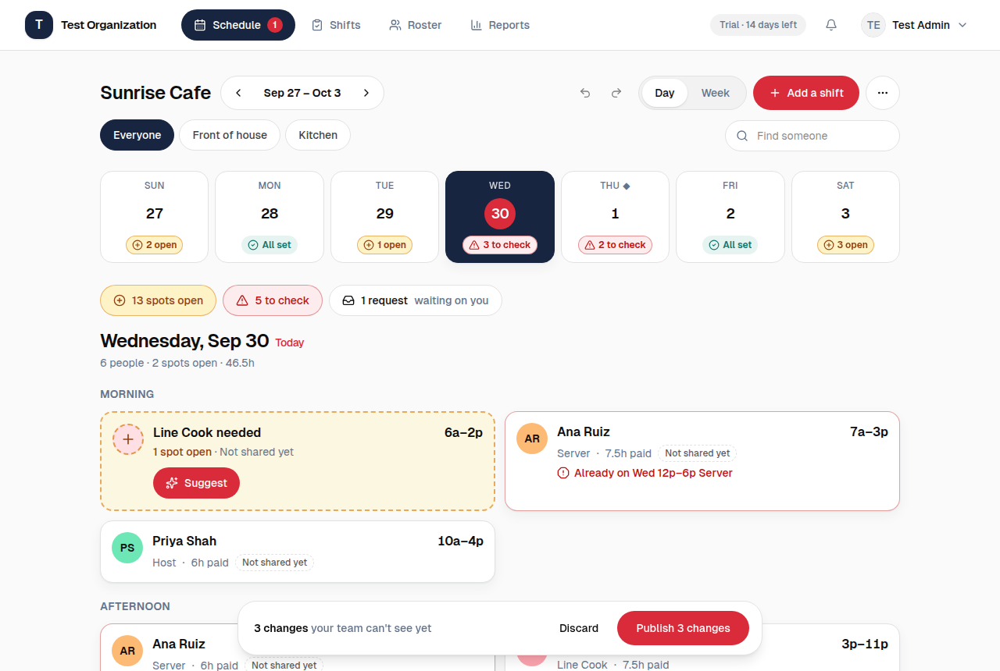
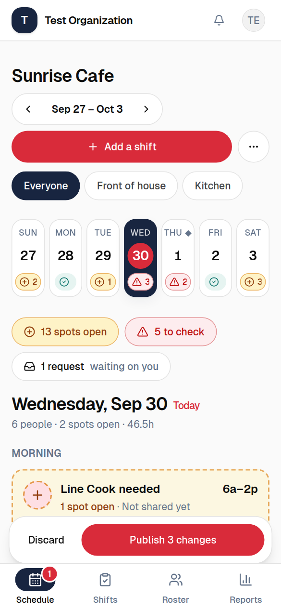
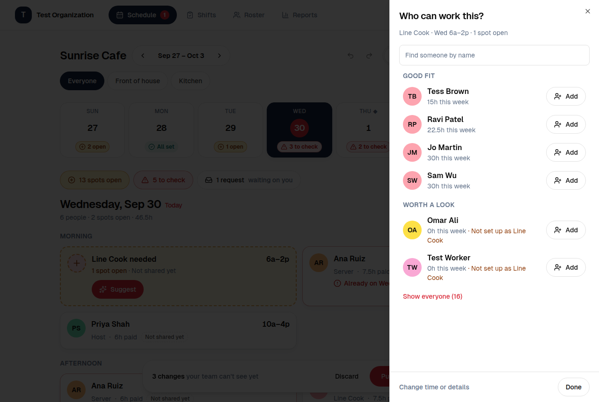
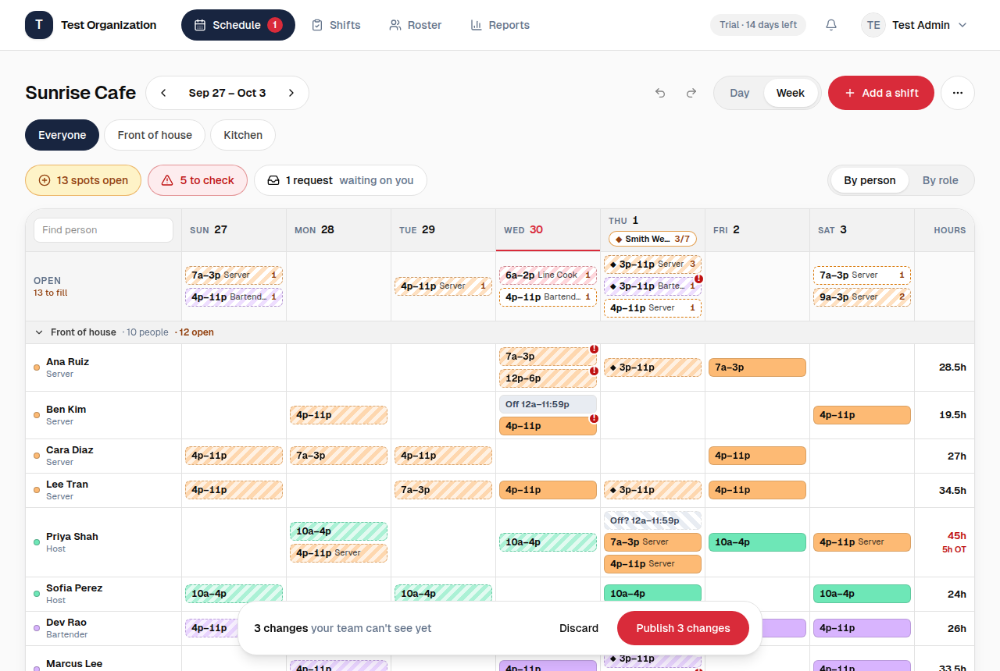

# Day-first Scheduler and a friendlier nav

This replaces the people × days "clean grid" (see `phase-1-plan.md` §2.1) as the
manager's **main** schedule view. The grid is still there as **Week**, tap-only.

## Why

When I Work, Staffmate and our own first Scheduler all lead with a dense grid of
tiny chips you drag around. It's fast for a scheduling expert and hostile to
everyone else: tiny targets, unreadable on a phone, impossible to use without a
mouse, and every state is a badge you have to learn.

The founder's brief: innovative, **not technical**, no drag-and-drop.

## What a manager sees

| | |
|---|---|
|  |  |
|  |  |

1. **Week strip.** Seven big tiles. Each says how covered its day is, in words and
   an icon: `All set`, `2 open`, `3 to check`, `Nothing yet` (a number on a narrow
   tile). A real conflict beats open spots, so it is never hidden.
2. **The day.** "Wednesday, Sep 30 · 6 people · 2 spots open · 46.5h", then
   Morning / Afternoon / Evening (by the time a shift starts: before 11:00, 11:00 to
   15:59, 16:00 on). Inside each: **needed cards** (dashed, warm) first, then **person
   cards**. Who's off is one plain line at the bottom.
3. **Suggest.** Tap it on a needed card. People are in three piles: *Good fit*
   (free, knows the role), *Worth a look* (a reason in words), *Can't work then*
   (you can still add them; that's an audited "Schedule anyway"). The sheet stays
   open until the shift is full.
4. **Add a shift.** Type `9-5`. Tap a role. Tick more days to add it on each. It's a
   draft until you publish.
5. **Publish bar.** Only appears when there's something your team can't see yet:
   "4 changes your team can't see yet · Discard · **Publish 4 changes**". It counts
   what a publish would actually send, so drafts whose time has already passed (which
   publishing skips) never leave it stuck on screen.

## No drag-and-drop: where everything went

| Was | Now |
|---|---|
| Drag a chip to another day or person | Shift sheet → **Day**; or **Copy to other days** |
| Drag from Open onto a person | **Suggest** on the needed card → Add |
| Drag to the Open row | **Take off** in the shift sheet (the spot stays, so it shows as needed) |
| Alt-drag, `c` then `v` | **Copy to other days** (one undoable step; "bring the same people" is a switch) |
| Click a cell and type | **Add a shift**, or tap an empty Week cell |
| Green/amber/red drop hints | The reasons are written in the Suggest list before you add |

Undo (`z`, the toast, the header button) and the audited overrides are unchanged:
the edit model (`plans.ts` → `useSchedulerEdits`) and the API did not change.

## Navigation

One `<nav>`, moved by CSS: pill tabs in the top bar from 768px up (navy when
active, the requests count in the Schedule tab), and a tab bar fixed to the bottom
of a phone. Before this there was **no navigation below 768px** at all. Keeping one
element means there's never a second, hidden copy for a screen reader or a test to
trip over while the stylesheet loads.

Labels are unchanged (Schedule · Shifts · Roster · Reports). Renaming them to be
friendlier is a good idea, deferred: it touches the e2e specs and the Settings →
Team vs Roster distinction.

## Colour

Red is the brand's button colour, so it can't also mean "problem" everywhere.

- `ok` (teal): covered. `warn` (amber): needs someone, or worth a look.
  `primary-soft`: a soft red wash behind real conflicts.
- Red text/borders: **only** for a real conflict (double-booked, approved time off).
- Every status is an icon plus words. Checked in greyscale.
- Tokens live in `packages/ui/src/styles/globals.css` (`--ok`, `--warn`,
  `--warn-line`, `--primary-soft`, `bg-page`, `shadow-card`), with dark values.

## Also changed along the way

- Geist, which was loaded but never applied, is now the app font.
- `html, body { overflow-x: clip }` instead of `hidden`, so `position: sticky` works.
- `prefers-reduced-motion` is honoured app-wide.
- The bell's "View settings" link points at a page that exists.
- `@dnd-kit/core` is gone.
- The `next dev` indicator sat over the phone's first tab; `NEXT_DEV_INDICATOR=off`
  switches it off and the Playwright web server sets it.

## Not done (and why)

- **Pending claims/drops/swaps on cards, location-scoped people, recurring
  availability, cost.** They need API work (or overturn "hours, not pay").
- **Optimistic updates.** Every edit still refetches the week. Fine at this size;
  revisit if the Day view feels slow on a big team.
- **Auto-assign.** Suggest ranks; a person still decides.
- **A separate "Today" page.** Today is the day the Day view opens on.

## Code map

`apps/web/lib/scheduler/day-model.ts` (coverage, day grouping, issues, publishable
count; unit-tested) · `plans.ts` (`planAddPerson`, `planTakeOff`, `planSetNeeded`,
`planCopyToDays`) · `candidates.ts` (`groupCandidates`) ·
`app/(protected)/schedule/_components/{week-strip,day-panel,person-card,needed-card,
suggest-*,add-shift-sheet,shift-drawer,publish-bar,schedule-header}.tsx` ·
`components/app-nav/*`.
