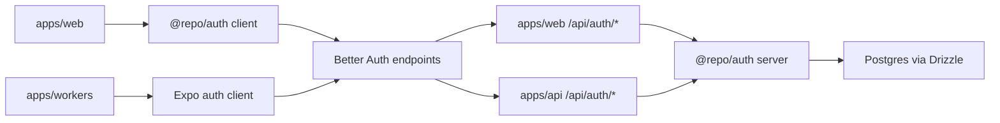
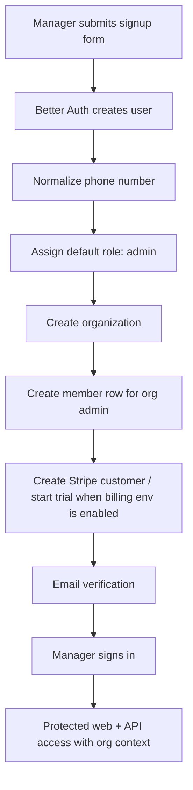
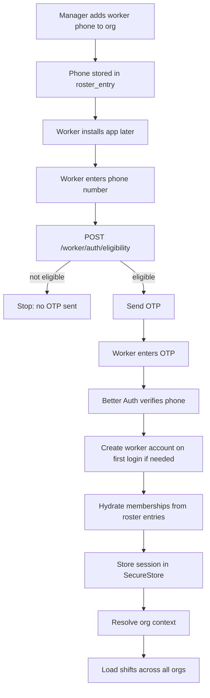

# Pavn Auth (`@repo/auth`)

Authentication and tenant-aware identity flow for WorkersHive.

This package is the single auth core for:
- `apps/web` manager authentication
- `apps/api` Hono auth/session verification
- `apps/workers` Expo worker authentication

The backend API stays in Hono. This package stays focused on identity, session, org membership hydration, OTP delivery, and Better Auth configuration.

## Stack

- [Better Auth](https://better-auth.com/)
- Drizzle adapter via `@better-auth/drizzle-adapter`
- Better Auth plugins:
  - `organization`
  - `emailOTP`
  - `phoneNumber`
  - `expo`
  - `stripe`
  - `dash` from `@better-auth/infra`
- PostgreSQL tables from `@repo/database`
- Twilio for SMS OTP
- Resend for email OTP
- SecureStore on Expo for worker session persistence

## Files

- [src/auth.ts](/Users/av/Documents/pavn/packages/auth/src/auth.ts): Better Auth server configuration
- [src/client.ts](/Users/av/Documents/pavn/packages/auth/src/client.ts): shared web auth client
- [src/worker-access.ts](/Users/av/Documents/pavn/packages/auth/src/worker-access.ts): worker phone eligibility and membership hydration
- [src/providers/sms.ts](/Users/av/Documents/pavn/packages/auth/src/providers/sms.ts): Twilio/mock SMS transport
- [src/session.ts](/Users/av/Documents/pavn/packages/auth/src/session.ts): session org helpers
- [src/env.ts](/Users/av/Documents/pavn/packages/auth/src/env.ts): auth env resolution and trusted origins

## Runtime Boundaries

## Core Principles

- Managers can self-sign up.
- The first manager creates the organization automatically.
- Workers do not freely self-register into the product.
- A worker phone number must already belong to at least one organization before OTP is sent.
- Worker install state is irrelevant; server-side phone eligibility is the source of truth.
- Deep links are convenience only, not the primary invite mechanism.

## Business Auth Lifecycle

### Manager signup

Managers sign up from the web app with:
- name
- email
- password
- phone number
- business name

Code path:
- [signup-form.tsx](/Users/av/Documents/pavn/apps/web/components/auth/signup-form.tsx)
- [src/auth.ts](/Users/av/Documents/pavn/packages/auth/src/auth.ts)

Server behavior:
1. Better Auth creates the user.
2. `databaseHooks.user.create.before` normalizes the phone number.
3. The new user defaults to role `admin`.
4. `databaseHooks.user.create.after` creates:
   - an `organization`
   - a `member` row linking the user to that org as `admin`
5. Email OTP verification is available through the `emailOTP` plugin.

### Billing / trial shape

This auth package is configured for subscription bootstrap, not marketplace payouts.

Current intent:
- create a Stripe customer behind the scenes
- give the business a 7-day trial
- require no card at signup

Auth-side config lives in [src/auth.ts](/Users/av/Documents/pavn/packages/auth/src/auth.ts) through the Stripe plugin:
- `createCustomerOnSignUp: true`
- free trial days from `SUBSCRIPTION.TRIAL_DAYS`

Important distinction:
- this is a Stripe **customer/subscription** flow
- not a Stripe Connect account flow

### Manager sign-in

Managers sign in with email/password from:
- [login-form.tsx](/Users/av/Documents/pavn/apps/web/components/auth/login-form.tsx)

Session behavior:
- Better Auth issues the session
- web reads it via `authClient.useSession()`
- protected business/API routes use `auth.api.getSession(...)`
- org-scoped Hono routes require `x-org-id`

### Manager lifecycle diagram

## Worker Auth Lifecycle

### Worker eligibility rule

A worker can use the mobile app only if their phone number is already known to at least one org.

That eligibility is resolved in [src/worker-access.ts](/Users/av/Documents/pavn/packages/auth/src/worker-access.ts) from:
- existing active `member` records for a user with that phone number
- `roster_entry` rows with that phone number

This means the worker does **not** need to already have the app installed.

### Why install state does not matter

The real invite is server-side phone ownership:

1. Manager adds/imports/invites worker with phone number.
2. Backend stores the phone number in `roster_entry` and optionally Better Auth invitation records.
3. Days later, the worker installs the app and enters that same phone number.
4. The server checks phone eligibility.
5. If eligible, OTP is allowed.
6. If not eligible, login is blocked.

### Worker login flow

Worker mobile sign-in lives in:
- [apps/workers/app/(auth)/login.tsx](/Users/av/Documents/pavn/apps/workers/app/(auth)/login.tsx)
- [apps/workers/lib/worker-auth.ts](/Users/av/Documents/pavn/apps/workers/lib/worker-auth.ts)

Flow:
1. Worker enters phone number.
2. App calls public API `POST /worker/auth/eligibility`.
3. If not eligible:
   - no OTP is sent
   - UI shows "not invited yet"
4. If eligible:
   - app calls `authClient.phoneNumber.sendOtp`
5. Worker enters OTP.
6. App calls `authClient.phoneNumber.verify`
7. Better Auth:
   - verifies the OTP
   - creates a worker account automatically on first verification if needed
   - creates a session
8. `callbackOnVerification` hydrates org memberships from `roster_entry`
9. App stores the session token in SecureStore
10. App restores org context and loads `All orgs`

### Worker first-login account creation

The `phoneNumber` plugin in [src/auth.ts](/Users/av/Documents/pavn/packages/auth/src/auth.ts) is configured with:
- `signUpOnVerification`
- `callbackOnVerification`

So first-time worker login no longer needs:
- password creation
- mandatory invite-link redemption

If the worker has no existing Better Auth user yet, verification creates one automatically using:
- temp email from `getWorkerTempEmail(...)`
- display name from the best matching roster record when available

### Worker membership hydration

After OTP verification, [syncWorkerMembershipsForPhone(...)](/Users/av/Documents/pavn/packages/auth/src/worker-access.ts) does the following:

1. finds all roster records matching the normalized phone number
2. inserts missing `member` rows
3. reactivates non-active memberships when needed
4. copies role / job title / hourly rate from roster data
5. marks matching roster entries as `active`
6. marks matching invitation rows as `accepted` when email matches roster data
7. forces the user role to `worker`

### Worker session persistence

Worker sessions are sticky by design.

Code path:
- [apps/workers/lib/auth-client.ts](/Users/av/Documents/pavn/apps/workers/lib/auth-client.ts)
- [apps/workers/lib/organization-context.ts](/Users/av/Documents/pavn/apps/workers/lib/organization-context.ts)
- [apps/workers/lib/api.ts](/Users/av/Documents/pavn/apps/workers/lib/api.ts)

Behavior:
- session token is persisted in SecureStore
- app start checks `authClient.getSession()`
- active org is restored from:
  - stored org id
  - session `activeOrganizationId`
  - `/worker/organizations` fallback
- cross-org worker routes avoid blocking on a single org

### Worker lifecycle diagram

## Hono API Integration

The API server mounts Better Auth at:
- [apps/api/src/index.ts](/Users/av/Documents/pavn/apps/api/src/index.ts)

Relevant public endpoints:
- `GET /health`
- `GET /ready`
- `POST/GET /api/auth/*`
- `POST /worker/auth/eligibility`

Protected routes use:
- Better Auth session lookup
- `x-org-id` org scoping for org-bound endpoints
- cross-org exemptions for worker aggregate routes

## Web Integration

The Next.js handler lives at:
- [apps/web/app/api/auth/[...all]/route.ts](/Users/av/Documents/pavn/apps/web/app/api/auth/[...all]/route.ts)

The shared web client lives at:
- [src/client.ts](/Users/av/Documents/pavn/packages/auth/src/client.ts)

## Mobile Integration

The Expo worker client lives at:
- [apps/workers/lib/auth-client.ts](/Users/av/Documents/pavn/apps/workers/lib/auth-client.ts)

Key pieces:
- `expoClient(...)`
- SecureStore session persistence
- phone-number client plugin
- org-aware API wrapper

## SMS Behavior

SMS transport is in [src/providers/sms.ts](/Users/av/Documents/pavn/packages/auth/src/providers/sms.ts).

Rules:
- `MOCK_SMS=true` disables real Twilio delivery
- development mock writes OTP to `/tmp/latest-otp.txt`
- production requires Twilio env

For this product direction:
- SMS should stay focused on authentication
- shift reminders and arrival nudges should be in-app / push first

## Environment

Minimum auth env:
- `BETTER_AUTH_SECRET`
- `BETTER_AUTH_URL`
- `NEXT_PUBLIC_APP_URL`

Worker-auth relevant env:
- `TWILIO_ACCOUNT_SID`
- `TWILIO_AUTH_TOKEN`
- `TWILIO_PHONE_NUMBER`
- `MOCK_SMS`
- `EXPO_PUBLIC_API_URL`

Optional:
- `BETTER_AUTH_API_KEY`
- `BETTER_AUTH_API_URL`
- `BETTER_AUTH_KV_URL`
- `RESEND_API_KEY`
- `EMAIL_FROM`

## Current Product Rules Captured In Code

- Business users self-register.
- The first business signup creates the org automatically.
- Workers authenticate with phone OTP.
- Workers cannot use the app until a business has already added their phone.
- Workers can belong to multiple orgs.
- Worker home should default to all-org scheduling visibility.
- Cross-org conflicts should notify the worker, not block assignment.

## Open Follow-ups

- Billing ownership is still user/plugin-centric and may need a dedicated org-billing reconciliation pass.
- If the business flow should allow worker access without email, manager-side invite UX should eventually make phone mandatory for worker mobile onboarding.
- If we later need a stricter invite audit trail, invitation acceptance can be formalized beyond roster-driven membership hydration.
